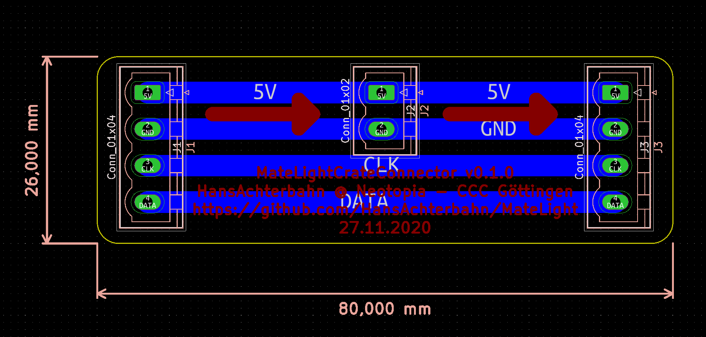

# MateLightScrewCap

This repo is an addition to the MateLightScrewCap and enhances it with a crate connector PCB. The PCB not only allows easy connection of the crates, but also easy power supply between the crates. This is useful to avoid power transfer problems, voltage drops and heat problems.

In this repository you will find the schematics and board layouts created in KiCad. You will also find a 3D model of the circuit board.

*Fork me and have fun!*

## 3D View

FreeCAD Model: [3d/MateLightCrateConnector.FCStd](https://github.com/HansAchterbahn/MateLightScrewCap/blob/master/3d/MateLightCrateConnector.FCStd)
Animated 3D STL model: [3d/MateLightCrateConnector.stp](https://github.com/HansAchterbahn/MateLightScrewCap/blob/master/3d/MateLightCrateConnector.stl)

__Top view__

__Bottom view__

## Schematic

## Board

